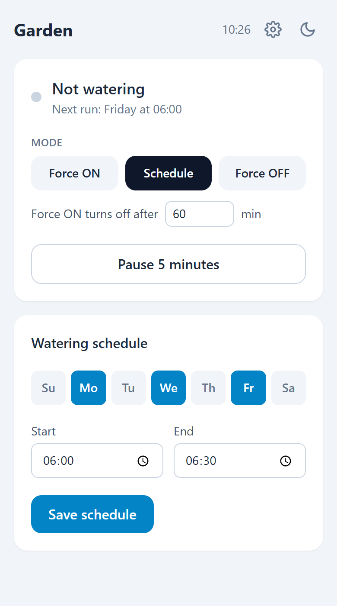
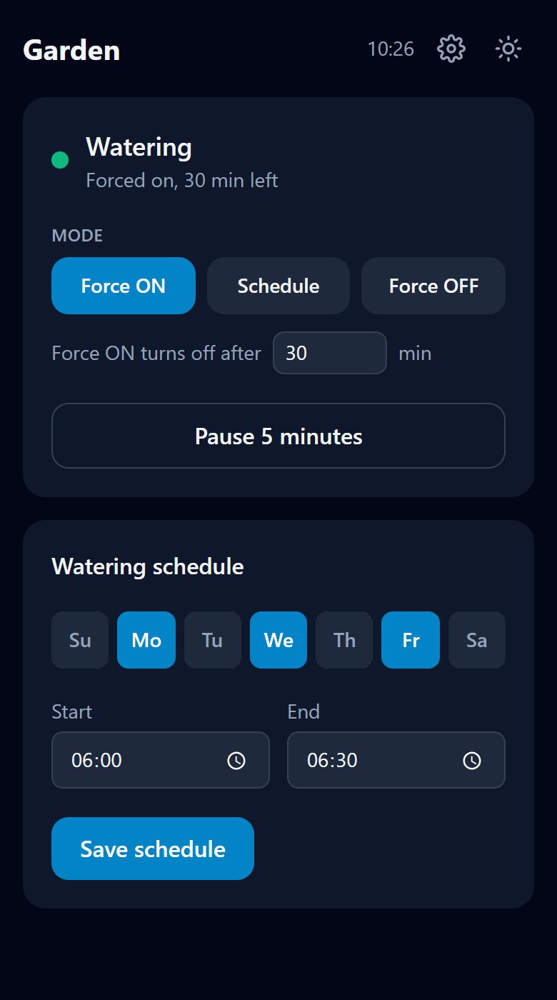
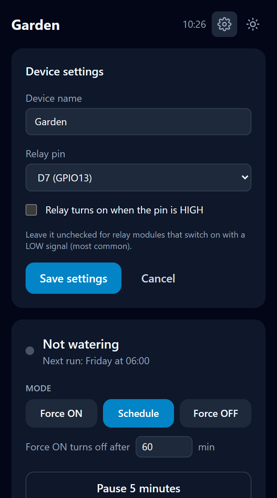

# ESP8266 Smart Irrigation System

A WiFi-enabled smart irrigation controller built on the ESP8266 microcontroller. This system allows you to remotely control your irrigation system through a responsive web interface, schedule watering times, and manage your garden or lawn watering automatically.

<p align="center">
  
  &nbsp;
  
  &nbsp;
  
</p>

## Features

✨ **Smart Scheduling**
- Set custom watering schedules for specific days of the week
- Define start and end times for automated irrigation
- View next scheduled run time at a glance

🌐 **Web Interface**
- Responsive page that works on phones (one column) and computers (two columns)
- Dark mode that follows the device theme, with a toggle button that remembers your choice on each device
- Status refreshes every 5 seconds: watering or not, current mode, pause time left, next run
- Manual override controls (Force ON/OFF), with the Force ON duration set on the page
- Schedule configuration via web form

⚙️ **Device Settings**
- Set the device name (shown at the top of the page and in the browser tab), the relay pin, and whether the relay turns on with a HIGH or a LOW signal
- Changes apply right away, without restarting the board

💾 **Settings Survive Restarts**
- The schedule, Force OFF and the device settings are saved in flash (EEPROM emulation) and restored at boot
- They also survive uploading a new sketch (unless **Tools > Erase Flash** is set to "All Flash Contents")
- Flash is only written when a value actually changes
- Force ON and the 5-minute pause are timed, so they are not saved: after a restart the board follows the schedule

🔌 **JSON API**
- Every action returns the controller's state as JSON, so it can be scripted or used by other apps

⏰ **Time Management**
- NTP (Network Time Protocol) synchronization at boot, then again every hour (ESP8266 core default)
- The schedule waits until the clock is set, so a board that boots without internet doesn't water at a wrong time (Force ON still works)
- Configurable timezone and daylight saving offset

🎛️ **Flexible Control Modes**
- **Automatic Mode**: Follow the configured schedule
- **Force ON**: Override schedule to turn irrigation ON, then go back to the schedule after 60 minutes (or the duration you set)
- **Force OFF**: Override schedule to turn irrigation OFF
- **Temporary Disable**: Pause for 5 minutes (useful during maintenance)

## Project Files

| File | What it is |
|---|---|
| `esp8266-smart-irrigation.ino` | The firmware: Wi-Fi, schedule, relay, settings in flash, web server and JSON API |
| `index_html.h` | Minified web page stored in flash, included by the sketch. Generated by `minify.py`, don't edit it by hand |
| `web/index.html` | Readable source of the web page |
| `minify.py` | Builds `index_html.h` from `web/index.html` |
| `simulator.py` | Runs the web page on your computer with a fake controller, no board needed |
| `tests/` | Automated tests, run with `python tests/run_tests.py` |
| `docs/` | [Testing guide](docs/TESTING.md) and screenshots |

## Hardware Requirements

- **ESP8266 Development Board** (NodeMCU, Wemos D1 Mini, or similar)
- **Relay Module** (5V relay recommended)
- **Power Supply** (5V for ESP8266, appropriate voltage for your irrigation system)
- **Solenoid Valve/Pump** (compatible with your relay)
- Jumper wires and breadboard (for prototyping)

### Pin Configuration

| Component | ESP8266 Pin |
|-----------|-------------|
| Relay Control | D7 (GPIO13) by default; D1, D2, D5, D6 or D7 can be chosen in the device settings |
| Built-in LED | `LED_BUILTIN` (lights up while connecting to WiFi) |

By default the relay is driven as **active LOW** (it turns on when the pin is LOW), which matches most relay modules. If yours turns on with a HIGH signal, tick "Relay turns on when the pin is HIGH" in the device settings.

## Software Requirements

### Arduino Libraries
- `ESP8266WiFi` - WiFi connectivity
- `ESP8266WebServer` - Web server functionality
- `EEPROM` - Saving settings to flash (included with the ESP8266 core)
- `ESP32Time` - RTC (Real-Time Clock) management
- `time.h` - Time utilities

The web page uses Tailwind CSS from its CDN, so the browser opening it needs internet access for the styling.

### Installation

In the [Arduino IDE](https://www.arduino.cc/en/software) 2:

1. **File > Preferences > Additional boards manager URLs**: add `https://arduino.esp8266.com/stable/package_esp8266com_index.json`
2. **Tools > Board > Boards Manager**: install **esp8266** by ESP8266 Community (tested with 3.1.2)
3. **Tools > Manage Libraries**: install **ESP32Time** by fbiego (tested with 2.0.6; it works on the ESP8266 too)

`ESP8266WiFi`, `ESP8266WebServer` and `EEPROM` come with the esp8266 board package.

With [arduino-cli](https://arduino.github.io/arduino-cli/) instead:

```bash
arduino-cli config add board_manager.additional_urls https://arduino.esp8266.com/stable/package_esp8266com_index.json
arduino-cli core update-index
arduino-cli core install esp8266:esp8266
arduino-cli lib install ESP32Time
arduino-cli compile --fqbn esp8266:esp8266:nodemcuv2 .
arduino-cli upload --fqbn esp8266:esp8266:nodemcuv2 -p COM5 .   # your board's port
```

The sketch uses about 290 KB of flash (27%) and 30 KB of RAM (37%) on a NodeMCU.

## Getting Started

### 1. Configuration

Open `esp8266-smart-irrigation.ino` and modify the following settings:

```cpp
const char *ssid = "REPLACE_WITH_SSID";         // Your WiFi network name
const char *password = "REPLACE_WITH_PASSWORD"; // Your WiFi password

const long gmtOffset_sec = 3600;             // GMT offset in seconds (3600 = GMT+1)
const int daylightOffset_sec = 0;            // Daylight saving offset (0 or 3600)
```

### 2. Upload

The Arduino IDE needs the sketch folder to have the same name as the `.ino` file. A clone already does:

```bash
git clone https://github.com/Ghorbel37/esp8266-smart-irrigation.git
```

If you use **Download ZIP** instead, rename the extracted folder from `esp8266-smart-irrigation-main` to `esp8266-smart-irrigation`. Otherwise the IDE offers to move the `.ino` into a new folder, `index_html.h` stays behind and the build fails.

1. Open `esp8266-smart-irrigation.ino` in the Arduino IDE
2. Connect your ESP8266 board to your computer with a USB **data** cable (some cables only charge)
3. **Tools > Board > esp8266**: pick your board, e.g. **NodeMCU 1.0 (ESP-12E Module)** or **LOLIN(WEMOS) D1 R2 & mini**
4. **Tools > Port**: pick the board's COM port (it appears when the board is plugged in)
5. Click **Upload**

### 3. Find Your Device

After uploading, open the Serial Monitor (115200 baud) to see the IP address assigned to your ESP8266:

```
Settings loaded from flash
Connecting to Wifi
.....Connected to WiFi
Initialized time
ESP8266 Web Server's IP address: 192.168.x.x
```

On the first start, the first line is `No saved settings, using defaults` followed by `Settings saved`. `Failed to obtain time` means NTP didn't answer yet (see Troubleshooting).

### 4. Access the Web Interface

Open a web browser and navigate to the IP address shown in the Serial Monitor (e.g., `http://192.168.1.100`)

## Usage

### Setting Up a Schedule

1. Navigate to the web interface
2. Select the days of the week you want watering to occur
3. Set the start time (when irrigation begins)
4. Set the end time (when irrigation stops)
5. Click "Save schedule"

**Example Schedule:**
- Days: Monday, Wednesday, Friday
- Start Time: 06:00 AM
- End Time: 06:30 AM

This will water your garden for 30 minutes on Monday, Wednesday, and Friday mornings.

A run can cross midnight: with Monday selected, 23:00 → 01:00 waters from Monday 23:00 until Tuesday 01:00.

### Manual Control

- **Force ON**: Immediately activates irrigation, ignoring the schedule. It turns off by itself after the time set in "Force ON turns off after … min" (60 by default, up to 1440 = 24 hours). Each browser remembers the value you pick; the board doesn't store it
- **Force OFF**: Immediately deactivates irrigation, ignoring the schedule
- **Schedule**: Returns to automatic schedule mode
- **Pause 5 minutes**: Temporarily pauses scheduled irrigation for maintenance

### JSON API

| Endpoint | Action |
|---|---|
| `GET /api/state` | Current state |
| `POST /relay1/on` with `minutes=60` | Force ON, back to the schedule after `minutes` (optional: 60 by default, at most 1440) |
| `POST /relay1/off` | Force OFF |
| `POST /relay1/clear` | Back to the schedule |
| `POST /disable` | Pause for 5 minutes |
| `POST /setSchedule` with `day=1&day=3&startTime=06:00&endTime=06:30` | Save the schedule (days: 0 = Sunday … 6 = Saturday) |
| `POST /config` with `name=Garden&pin=13&activeHigh=0` | Save the device settings (each argument is optional; `pin` is a GPIO number: 5, 4, 14, 12 or 13) |

Actions only accept POST, with the arguments form-encoded in the body, so opening a link can't switch the water on. For example:

```bash
curl -d minutes=30 http://192.168.1.100/relay1/on
curl -d day=1 -d day=3 -d startTime=06:00 -d endTime=06:30 http://192.168.1.100/setSchedule
```

Every endpoint returns the same JSON (`paused` and `onLeft` are the seconds left in the pause and in Force ON):

```json
{"mode": "auto", "relay": false, "paused": 0, "onLeft": 0, "days": [0,1,0,1,0,0,0], "start": "06:00", "end": "06:30", "time": "14:05", "next": "tomorrow at 06:00", "name": "Irrigation ESP", "pin": 13, "activeHigh": false}
```

## Try It Without the Board

`simulator.py` serves the web page, minified exactly like on the board, and fakes the controller using your computer's clock. It only needs Python 3.10+:

```bash
python simulator.py        # then open http://localhost:8000
python simulator.py 8080   # use another port
```

You can open it from your phone too at `http://<your-pc-ip>:8000` (same Wi-Fi). Nothing is saved: restarting the simulator resets the settings.

## Editing the Web Page

The page's readable source is [`web/index.html`](web/index.html). The sketch doesn't use it directly: it includes `index_html.h`, a minified copy (comments, indentation and line breaks removed, about 27% smaller) that is stored in flash.

1. Edit `web/index.html`. In its scripts, end every statement with `;`, since line breaks are removed.
2. Check it with `python simulator.py`: the simulator minifies the page on every refresh, so changes show up right away.
3. Rebuild the header and upload the sketch:

```bash
python minify.py           # web/index.html -> index_html.h
python minify.py --check   # only check that index_html.h is up to date
```

`minify.py` only needs Python 3.10+. Run `python tests/run_tests.py --browser` afterwards to check the page (see [Testing](#testing)).

## Testing

```bash
python tests/run_tests.py          # minifier, simulator and firmware tests (about 2 seconds)
python tests/run_tests.py --all    # + the page in a headless browser and a real ESP8266 build
```

The firmware tests compile the real sketch on your computer against fake Arduino libraries. [docs/TESTING.md](docs/TESTING.md) explains what each suite checks, what it needs (Python 3.10+, a C++ compiler, optionally Playwright and the Arduino tools), when to run what, and a checklist for testing on a real board.

## Wiring Diagram

```
ESP8266 (D7) -----> Relay IN     (or the pin chosen in the device settings)
ESP8266 (GND) ----> Relay GND
ESP8266 (3V3/5V) -> Relay VCC

Relay COM --------> Power Supply (+)
Relay NO ----------> Irrigation Valve (+)
Valve (-) ---------> Power Supply (-)
```

⚠️ **Warning**: Ensure your relay can handle the voltage and current requirements of your irrigation system. Use appropriate isolation and safety measures when working with mains voltage.

## Troubleshooting

### Board Doesn't Appear in Tools > Port
- Use a USB data cable: many cables only charge
- Install the USB-serial driver for your board's chip (printed near the USB port): [CH340](https://www.wch-ic.com/downloads/CH341SER_EXE.html) on most clones, [CP2102](https://www.silabs.com/developers/usb-to-uart-bridge-vcp-drivers) on NodeMCU v1.0 boards
- The board shows up in Windows Device Manager under **Ports (COM & LPT)**

### ESP8266 Won't Connect to WiFi
- Verify SSID and password are correct
- Check WiFi signal strength
- Ensure your router supports 2.4GHz (ESP8266 doesn't support 5GHz)

### Relay Not Switching
- Check wiring connections
- Verify relay is compatible with 3.3V logic or use a level shifter
- Test relay independently with a simple sketch

### Web Interface Not Loading
- Ping the ESP8266 IP address to verify network connectivity
- Check that port 80 is not blocked by firewall
- Try accessing from the same subnet

### Page Shows Without Styling
- The styles come from the Tailwind CDN: the phone or computer opening the page needs internet access (the board itself doesn't)

### Page Says "waiting for the clock"
- The board hasn't reached the NTP server yet, so the schedule is on hold. Check that the Wi-Fi network has internet access; Force ON/OFF still work meanwhile

## Contributing

Contributions are welcome! Please feel free to submit a Pull Request.

## License

[MIT](LICENSE) © 2025 Mahdi Ghorbel

---

**Made with 💧 for smarter irrigation and protecting the planet**
